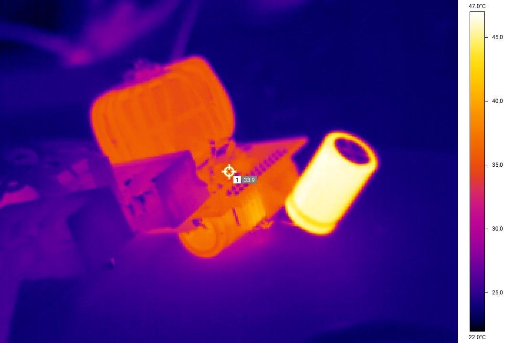
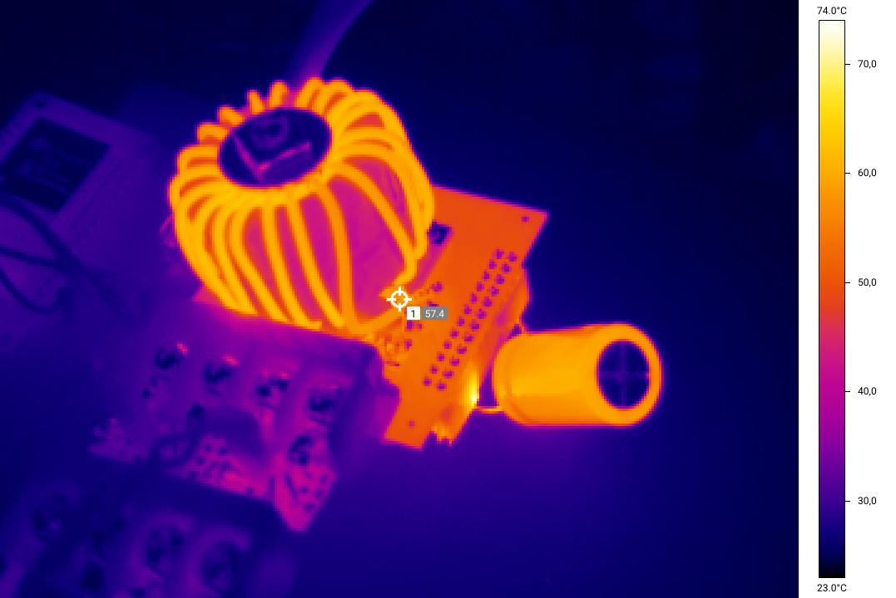

# Hardware

* [EPC90133](https://epc-co.com/epc/products/demo-boards/epc90133) dev board
  * Onboard Input Caps (total 11,54uF) (see [schematics](https://epc-co.com/epc/documents/schematics/EPC90133_Schematic.pdf))
      * Intermediate: 10x 1uF,100V X7R 0805 SMD (KYOCERA 08051C105K4Z2A)
      * HF Loop:     7x 220nF,100V X7S 0603 SMD (Taiyo Yuden HMK107C7224KAHTE)
* 2 cores [T120 Sendust](https://www.semic.info/ljf-t130-s-060a-bk-en/), 1.8mm copper wire, 20 turns, 47uH, DCR=9mOhm
* C_out and external C_in: [Chengxing 470uF, 100V](https://www.lcsc.com/product-detail/_CX-Dongguan-Chengxing-Elec-_C72551.html)
* DIY heat sink for the GaN switches 

GaN switches feature very short switching times. This reduces switching losses. Much higher switching frequencies (>=
500kHz) possible.
Smaller caps and inductor needed. Smaller inductors and caps both have less expected losses due to smaller parasitics.
500 kHz appears to be a good start. 
I do my first tests with much lower frequencies though, see below.

# Low Frequency Tests

For a side-by-side comparision to Si-FETS, I used the same coil and capacitors and started with a low
frequency of 39 kHz.

# IR Images

*39KHz duty 50%, Vin=55V, Vout=27V, Pin=248W (I=4.5A). Input cap wastes energy.*

*39KHz duty 50%, Vin=59.5V, Vout=28.8, Pin=991W. With higher power the loss of the inductor becomes significant.*

## Conversion Loss Measurement Results

* V(io)=55V/27V,Pin=248W, dc50%, loss: 1.7%
* V(io)=59.5/28.8,Pin=991W,dc50%, loss: 3.17%, 31W (Si-Fugu: >5.2% loss)
* 50 khz: V=59.0/28.6,Pin=978W,dc50%, loss: 3.16% 

## Findings
* ~~No audible noise (as compared to th 7.8 kHz from the Silicon-Fugu)~~ noise came from power supply
* Input capacitor ([Chengxing 470uF, 100V](https://www.lcsc.com/product-detail/_CX-Dongguan-Chengxing-Elec-_C72551.html)
  Rs@10kHz=110mOhm) appears to waste most of the energy. To improve this try another cap, multiple caps in parallel (e.g. 4x) or increase switching frequency.
* Lower loss compared to Si-FETs 3.2% vs 5.2% using same passive components and same sw. freq.

# HF Impulse Inductors

These might be worth to try at 500 kHz and beyond.
- SER2011-202MLB (or SER2011-202MLD) (2uH, 40A, from EPC9158 demo board)
- AGM2222-322ME
- AGP4233-562 (lowest loss according to [dc-dc-optimizer](https://www.coilcraft.com/en-us/tools/dc-dc-optimizer/))
- SER2915L-682
- AGP4233-332
- WE 7443640330B
- WE 7443763521022
- WE 7443763521033

# Resources

- https://epc-co.com/epc/Portals/0/epc/documents/application-notes/How2AppNote025%20How%20to%20Design%20Synchronous%20Buck%20Converter%20Using%20GaN%20FET.pdf
- https://epc-co.com/epc/design-support/training-videos/development-board-into-prototype
- https://epc-co.com/epc/Portals/0/epc/documents/briefs/Technology%20Brief_Development%20Board%20to%20Prototype.pdf
- https://epc-co.com/epc/products/demo-boards/epc9174
- https://mplab-discover.microchip.com/v2/item/com.microchip.code.examples/com.microchip.ide.project/com.microchip.subcategories.modules-and-peripherals.analog.adc-modules.adc/com.microchip.mplabx.project.epc9151-power-boost-acmc/1.0.1?view=about&dsl=EPC9151-power

# Burned
Unfortunately, I burned the board due to a missing PWM signal.
LS switch permanently closed, battery connected.

* Battery: 8s LiFePo4 (26V)
* Battery connection: 30A Fuse (Littelfuse 0997030.WXN), Total Battery Wire resistance 50mOhm 
* Inductor: 47uH, DCR=9mOhm

Current was oscillating, with peaks beyond >40A (I don't know the exact value due to clipping of the INA226 power monitor).
Mean clipped current was around 20A. The fuse didn't burn, after 2.7 s I broke the circuit to the battery manually.
With a smaller inductor the fuse might have opened earlier. The inductor also stored a lot of energy.
Rated min/max opening time at 60A of the fuse is 0.15 s / 5 s .
-> Bigger inductor needs quicker fuses?