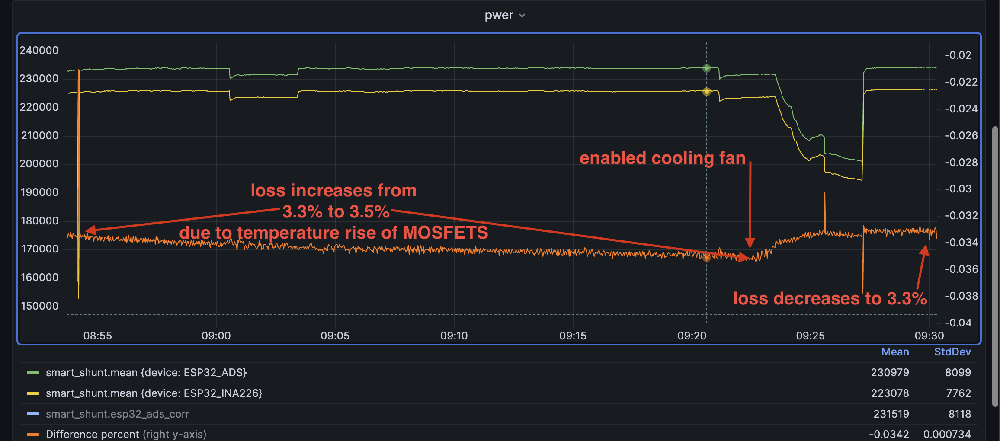
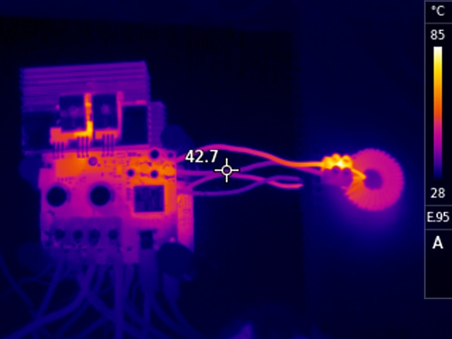
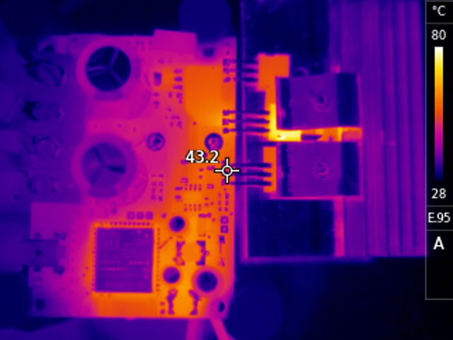
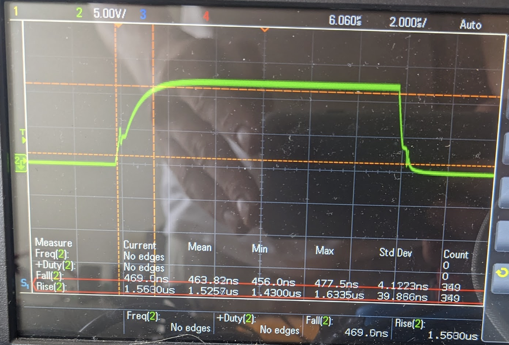
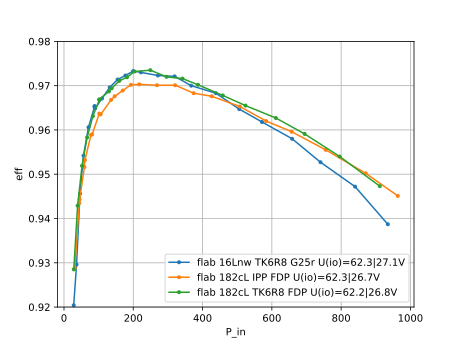

# Measurement Equipment

I used to power monitors, both single-point calibrated with Keithley DMM6500.

A cooling Fan is important. Semiconductors lose conductivity with increasing temperature.
For consistent test results, temperatures must stay constant.

Fugu Idle Power: 1.2W

## Power Monitor 1
- ESP32 
- INA226 with dedicated 3.3V supply (MCP1700 LDO)
- Shunt Resistor CIQI 40A / 75mV 0.5%
- LiPo power supply

## Power Monitor 2
- ESP32-S3
- ADS1117 
- SSA-100
- LiFePo4


*The 2 power monitors, shunts and the charger with coil.*


*Coils used in the tests below*

# Temperature Considerations

* green: input power (solar)
* yellow: output power (bat)
* orange: rel. loss


# Test 1.0

I did a few tests using various HW configuration (gate drive resistor, mosfets, coils, caps).

* Source: Power supply 58V, 4A
* Battery: 8s LiFePo4

V_in = 58V,
V_out = 27V,
I_in = 4090 mA,
P_in = 233 W

- Gate Driver: IR2104, 100ohm
- STP150N10F7 MOSfets
- Gate Rise Time: LS: 2.99us, HS: 3.49us
- Coil 1.6mm copper wire (16AWG) with 10cm connection cable 

-> Loss = 4.3%




*Thermal image of the PCB and the coil. The lustre terminal at the coil was not properly connected producing a lot of heat (85°C)*



*Board close-up*

# Test 1.1
Same as Test 1.0 but changed:
* HS Gate Drive resistor 100 -> 47ohm
* Rise Time 3.39us -> 2.46us

-> Loss = 3.9 % (before: 4.3%)

# Test 1.2
Changed:
* HS replaced STP150N10F7 (4.2mOhm) with IPP024N08NF2SAKMA1 (2.4mOhm) 
* Gate Rise Time: 1.5us
* Gate Fall Time: 0.46us

* 
-> Loss (cold) = 3.17 %  (before: 3.9%)
-> Loss (hot)  = 3.5 %

# Test 1.3
* 1.8mm inductor wire: loss 3.13%

# Test 1.4
double core inductor with 1.6mm wire: loss 3.12 %

# Test 1.5
HS FET: IPP024N08NF2SAKMA1->TK6R8A08QM (5.6mOhm, BUT much faster)
- 780ns Gate Rise Time
- Loss: 3.12 % -> 2.79%
- Switching losses are more important than conduction losses


# Test Series

* V_in=58V
* V_out= 27V (8s lifepo4)
* HW configuration same as Test 1.2
* Various duty cycles.


*Plot of conversion efficiency over input power*


# Findings

- Reducing HS gate resistor from 100 to 47 or 22 increases eff (also ringing/EMI!)
- The TK6R8 (HS) has lower loss than the IPP at lower power levels
- 10cm Wires to the coil can affect eff significantly
- A double core coil is more efficient, especially at higher power
- Using 1.4mm instead of 1.6mm coil wire reduces efficiency at all power levels 


```
* blue:   L(29.5T,1.6Wire,1core) HS(TK6R8)
* orange: L(  20T,1.8Wire,2core) HS(IPP  ) 
* gree:   L(  20T,1.8Wire,2core) HS(Tk6R8  ) 
``` 
