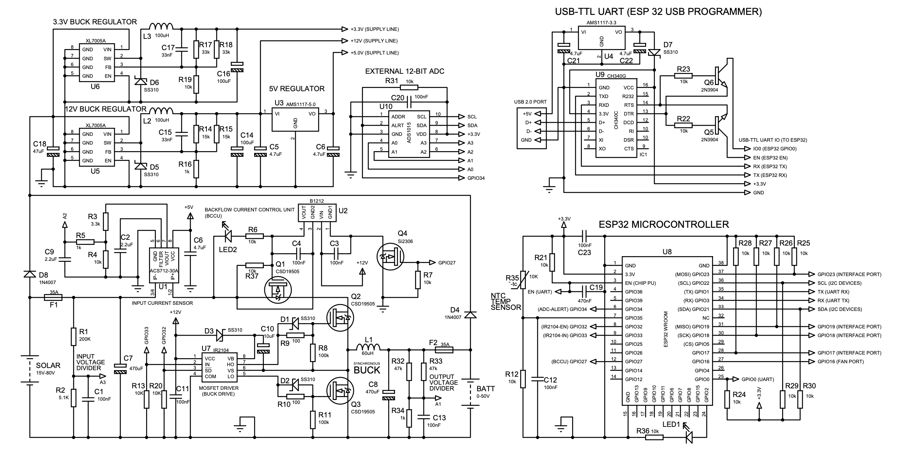

# Schematics

# Safety Notes

The firmware implements a simple observe and perturb MPPT algorithm with constant-current and constant-voltage boundary.
You can set the current and voltage using the device's buttons and LCD.

- The response of the charger to over-current and over-voltage with the original firmware can be slow. Keep this in mind
  when changing input voltage and battery voltage.
- Always connect the battery first. Otherwise it might destroy the device (including the ESP32) due to boost behavior of
  the buck converter, which causes excessive voltages at the input terminals. You might want to desolder D8 to avoid any
  risk of destroying the low-voltage components.
- Avoid loose contact to the battery, this can destroy the device
- To simulate a solar panel, connect a power supply to the input terminals. The power supply should not output more than
  20 A of current.
- Avoid fast rising voltages at the input
- After connecting the power supply it takes a couple of seconds until the charger starts

# Other Notes

- The WiFi function with the original firmware is currently defunct
- You can adjust Settings (Battery Voltage, Current, etc) through the LCD and Buttons

# Flashing

I set up a web flasher that works in Chrome, Edge and Opera
https://open.pe/fugu-web-flasher/
After flashing is complete reset the device, and it should start output logs on the serial port (at 115200 baud)

Alternatively to the Web Flasher, you can download the firmware code and open it in Arduino IDE. There you can build &
flash it on the ESP32. See instructions here: https://www.instructables.com/DIY-1kW-MPPT-Solar-Charge-Controller/

# 1. Functional Test
Equipment:
- 12V battery (lead or lithium)
- power supply, 18V, 2A

Steps:
- Connect a 12V battery (6s lead or 4s LiFePo4) to the Fugu’s battery terminals to power up the device
- The Device should display the Firmware version
- You can follow the device log on the serial port through the USB programmer. Baud rate is 115200.
- Use the keys to navigate to “SETTINGS MENU” and press select
  - Set SUPPLY ALGORITHM = MPPT + CC-CV
  - Set CHARGER/PSU MODE = CHARGER MODE 
  - Set MAX BATTERY V   to 14V for 12V batteries
  - Set MIN BATTERY V  to 11V for 12V batteries
  - Set CHARGING CURRENT to 2A
  - Exit the menu using the back button
- Connect a power supply to the Solar Inputs. Set Voltage to 18V and current to 2A

At this point the charger should draw less than 100 mA from the power supply.
Wait some seconds for the MPPT to initialize.
The charger should now charge the battery with 2A, drawing between 1.2 - 1.6A current from the power supply.
