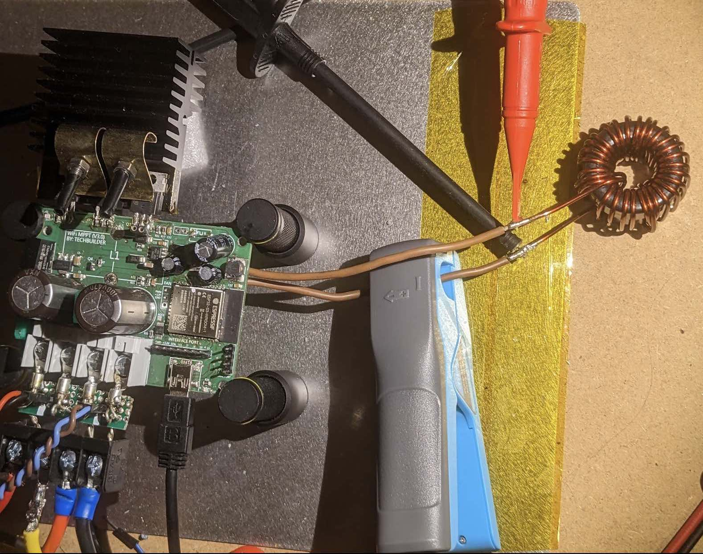
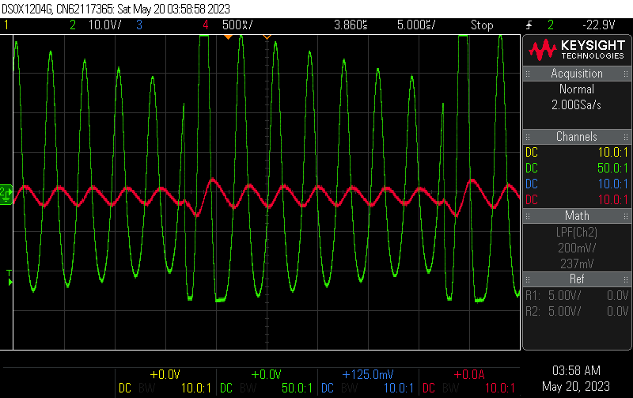
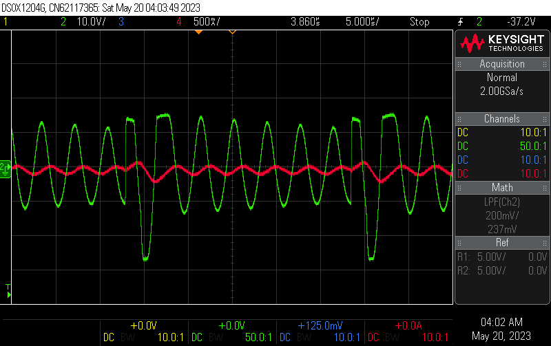
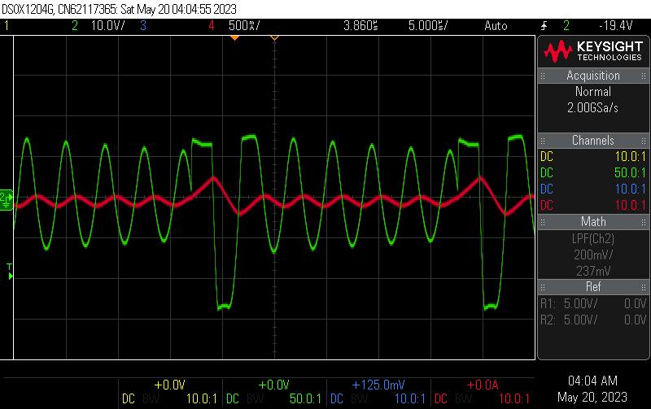
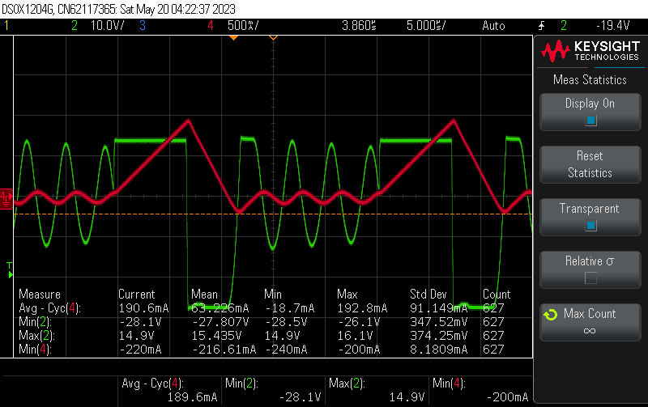
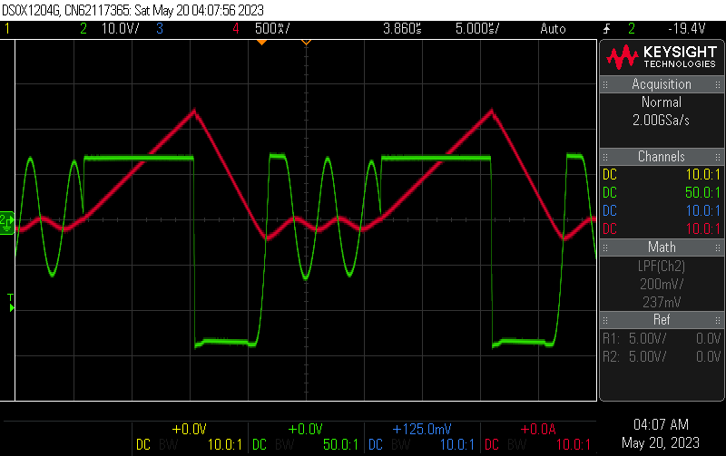
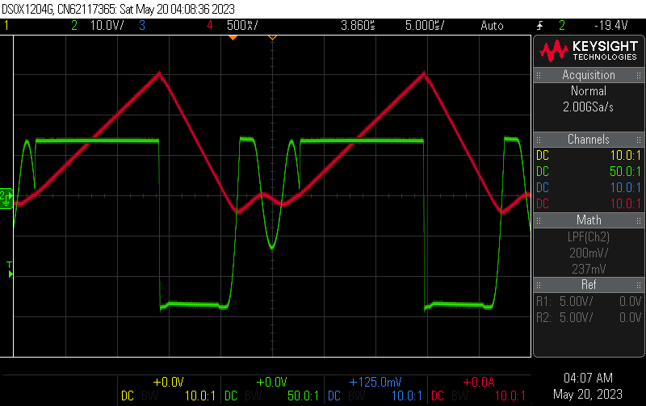
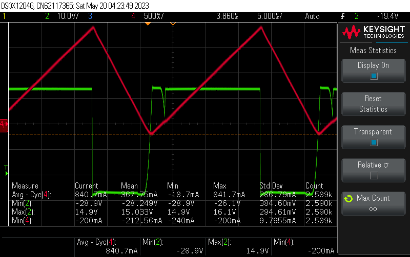
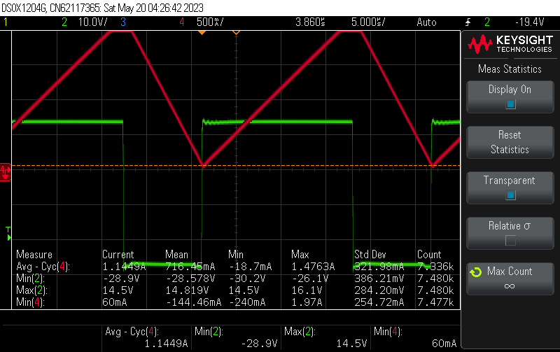
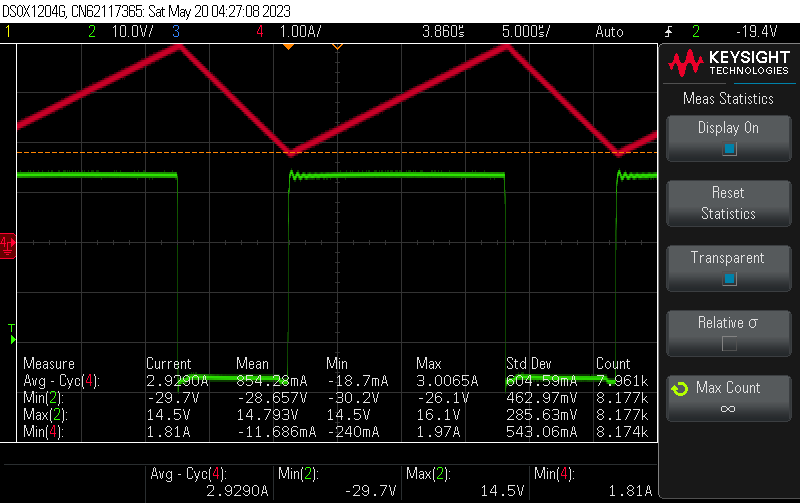

# Coil Current

Measuring the current through the coil can help debugging diode emulation of the Low-Side switch.
If diode emulation fails, the Low-Side switch is on for too long and the current crosses zero, becoming negative.
This can destroy the switch due to excess current. It can also generate dangerously high voltages at the buck
input terminals, because it will turn the buck into a (reverse) boost converter.

*Measuring coil current with a current clamp and coil voltage with a differential probe*

Here is a series of coil current (red) and voltage (green) wave forms for various High-Side and Low-Side duty cycles. 

* V_in 40V
* V_out = 26.5V
* PWM_MAX 2048 (11bit)

`PWM(H|L)=   0| 123`:

`PWM(H|L)=   123| 123`:

`PWM(H|L)=   200| 123`:

`PWM(H|L)= 600| 123`: (I_in=200mA)
 

`PWM(H|L)= 800| 361`:

`PWM(H|L)=1000| 450`:

`PWM(H|L)=1200| 543`: (I_in=600ma)

`PWM(H|L)=1250| 566`:

`PWM(H|L)=1390| 629`: (coil current starts to "lift-off")

`PWM(H|L)=1400| 624`

