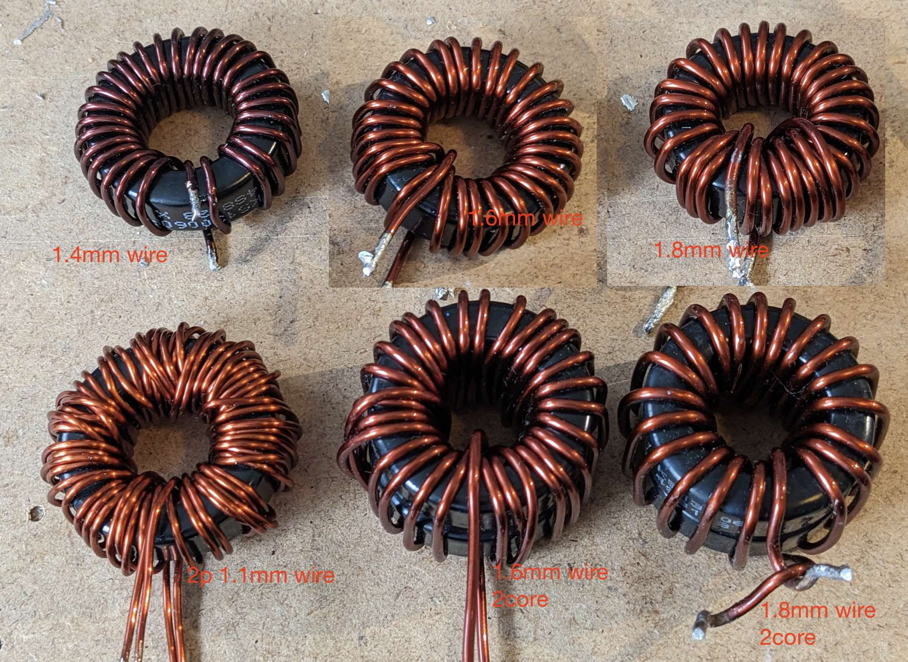
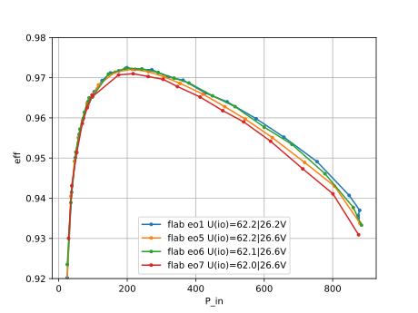

# rrr (1C18N30)
* 1core
* 1.8mm wire
* 30.5 Turns
* 56uH (Rs=20mOhm) @ 10khz
* DCR = 9mOhm

# rrw (1C16N29)
* 1core
* 1.6mm wire
* 29.5 Turns
* 55uH (Rs=18mOhm) @ 10khz
* DCR = 11mOhm

# wrr (1C2p11N)
* 1core
* 2p 1.1mm wire
* 59 uH (Rs=20mOhm) @ 10kHz
* DCR = 12.5mOhm

* eo1: rrr (1C18N30)
* eo5: wrr (1C2p11N) 
* eo6: rrw (1C16N29)
* eo7: xxx (1C14Nxx)

# N strands

* 2 stacked T130 sendust cores (u60)
* 2x1.8mm wire (1.3m)
* 