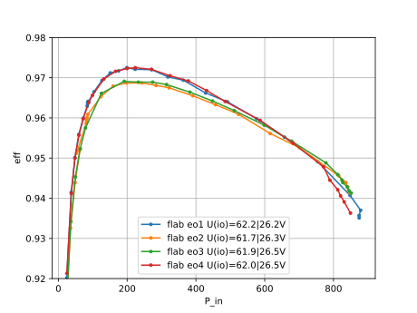
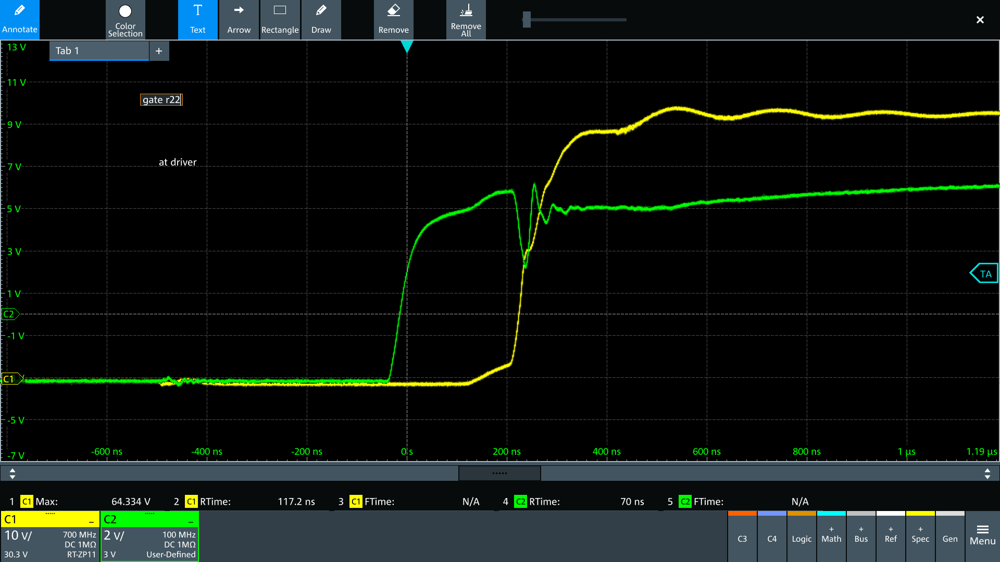
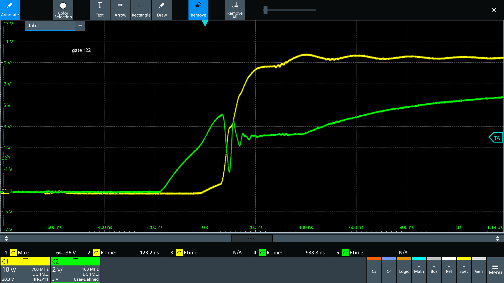

- fugu lab
- fan cooling
- HS: TK6r8a fet Gate Drive Resistor 50 ohm
- LS: TK6r8a fet Gate Drive Resistor 100 ohm
- BF Fet: FDP
- NXA Caps 470
- coil: 1 core, 1.8mm wire, (rrr)

# HS FET and Gate R
flab_eo1, ir110 img, HS gets super hot, 

# flab_eo2: replace hs TK6r8a with ipp024N08

HS G_R => 27.6 ohm
flab eo3

HS FET => TK6
fleb eo4
- with 27.6 ohm gate resistance, insignificant change < 770W, then worse compared to 50ohm
- flab eo1_1 to confirm

**Findings**
* until 700W, TK6R8A is better than ipp
* with TK6R8A, 27.6 ohm does not increase eff. > 770 its even worse than 50R

* eo1: TK6R8A08QM , 50R 
* eo2: IPP024N08NF2SAKMA1, 50R
* eo3: IPP024N08NF2SAKMA1, 28R
* eo4: TK6R8A08QM , 28R

# Coils
* eo5: Changed coil => wrr (1C2p11N)
* eo6 Changed coil => rrw (1C16N29)
* eo7 Changed coil => 1.4mm (1C14Nxx)

* eo1: rrr (1C18N30)
* eo5: wrr (1C2p11N) 
* eo6: rrw (1C16N29)
* eo7: xxx (1C14Nxx)

**Findings**
* 1.8mm coil marginally better than 1.6mm
* 2p 1.1mm coil performs worse with higher powers
  * TODO: use 1.2mm and shorten leads and reduce turns

# Input Caps

Tests using these 2 caps:
* [Chengxing 470uF, 100V](https://www.lcsc.com/product-detail/_CX-Dongguan-Chengxing-Elec-_C72551.html) (ERS=235mOhm @ 100kHz&10 Hz)
* [SamYoung Electronics NXA 100V470](https://www.lcsc.com/product-detail/_SamYoung-Electronics-_C165656.html) (ESR=127mOhm)

* fbox2 has (2x TK6R8), 47R HS Gate Drive
* In/out Caps: [Chengxing 470uF, 100V](https://www.lcsc.com/product-detail/_CX-Dongguan-Chengxing-Elec-_C72551.html)
* results in fbox2

* replaced Cin Chengxing (RS=235mOhm) with SamYoung (RS=127mOhm)
* results in fbox2_cap1

* fbox_cap2: added inp cap: 220nF, 630V, foil, ESR=180mOhm

* eo1: from previous coil test with flab (as reference), Cin/Cout = [SamYoung Electronics NXA 100V470](https://www.lcsc.com/product-detail/_SamYoung-Electronics-_C165656.html)
* fbox2: Cin/Cout = Chengxing 470uF, 100V 
* fbox2 cap1: Cin = SamYoung Electronics NXA 100V470
* fbox2 cap2: added 220nF

# Gate Resistors

* different HS gate resistors (7, 11 and 22 ohm)
* HS switch STP150N10F7
* LS CSD19505

# 2 HS switches

    'power_test_f2_2hs15TK_22r.csv', # 2HS (STP150N10F7 g@22r + TK6R8A g@22r)
    'power_test_f2_2hs15TK_11r.csv', # 2HS (STP150N10F7 g@22r + TK6R8A g@11r)
    'power_test_2hs15TK_11r22r.csv', # 2HS (STP150N10F7 g@11r + TK6R8A g@22r)