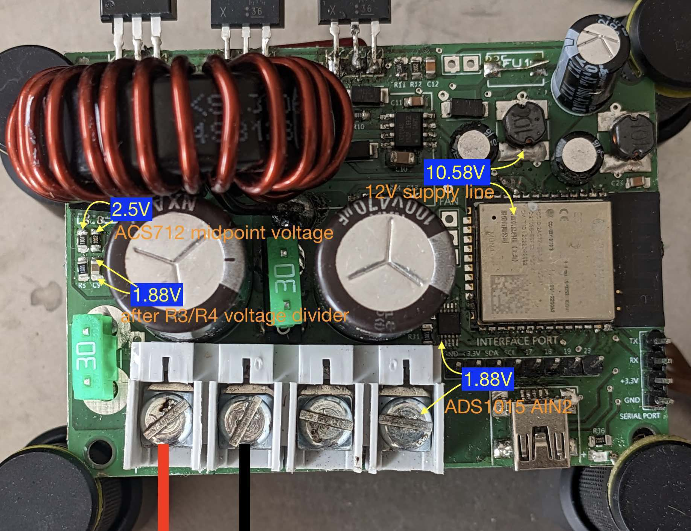

# USB Powered test

- Plug in the USB cable
- A new serial port should appear on your computer
- If not, there is an issue with the CH340C. Use a multimeter to measure its supply voltage.
- Use a serial monitor application (Arduino IDE, UNIX `screen`) to open the serial port with baud rate 115200
- You should see the ESP32 writing `invalid header: 0xa5ff005a` or similar
- This means that the USB-to-UART chip and the MCU are working. Hooray!

# Power supply test

In the previous USB powered test, we only powered the 3.3V line.
Now it's time to test the other components. Apply 4.5V to the solar terminals (with 200mA current limit).
4.5V is the minimum where we expect the 3.3V buck regulator to function. It is still low enough to not destroy the MCU
in case there is an issue with the regulator.

You should see the board drawing ~30 mA. Measure voltage at the 3.3V line, it should be ~3 V.
Now increase the power supply voltage to 5V. Measure voltage at the 3.3V line again, it should be almost 3.3 V.
Now slowly increase the power supply voltage to 14V, checking the 3.3V line voltage. If it gets above 3.3 V, immediately
remove power supply and check the PCB. Check feedback resistors. The voltage at the XL7005A's FB pin should be 1.24 V.

Measure voltage at the other 12V buck regulator output. It should be ~10.5V (*not* 12 V!)

# Flashing

Use the [web flasher](https://open.pe/fugu-web-flasher/) and follow instructions there.

## Troubleshooting

`A fatal error occurred: Failed to connect to ESP32-S3: Wrong boot mode detected (0x9)! The chip needs to be in download mode.`
Check transistors at the RTS and DTR pins of the CH240C.

# Voltage & Current Sensor Test
Once you flashed the firmware, and ESP32 the restarted, you should get voltage and current readings on the serial console.
Having a power supply at the solar input, confirm that input voltage matches the voltage set at the power supply. Use
a multi-meter to confirm.

The firmware will start with zero-current calibration. The ACS712-30 hall-sensor has a midpoint voltage (0 A) of 2.5V. 
If the deviation is too big (±500mA ≙ ±25mV), calibration will fail, and the charger will retry until calibration succeeds.
Measure output voltage at the hall-sensor with a multi-meter. If it is not 2.5V check hall-sensor power supply (measure voltage across C9).
Meausure voltage at ADC Channel A3 (pin 7), which should be ~1.88V .

*Three measurements points to test the current sensor signal*

If the device loops messages like `Zero Current too high: 39.05` means the ADS1015 reads 0V at AIN2.

USB Port Not working
* Check if your CH340 needs a crystal. Try another crystal. Add 22pF capacitors.
* Make sure the device gets enough power from the USB.